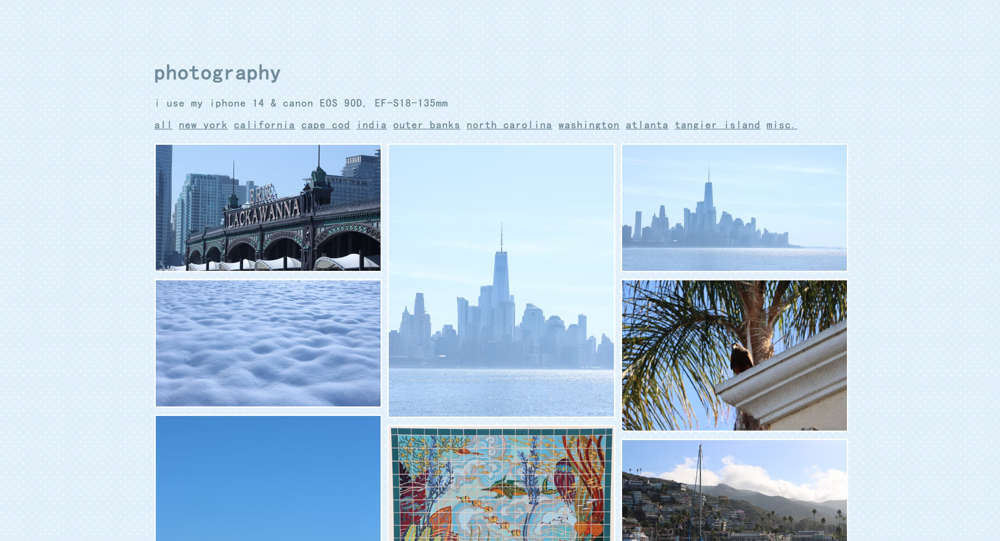
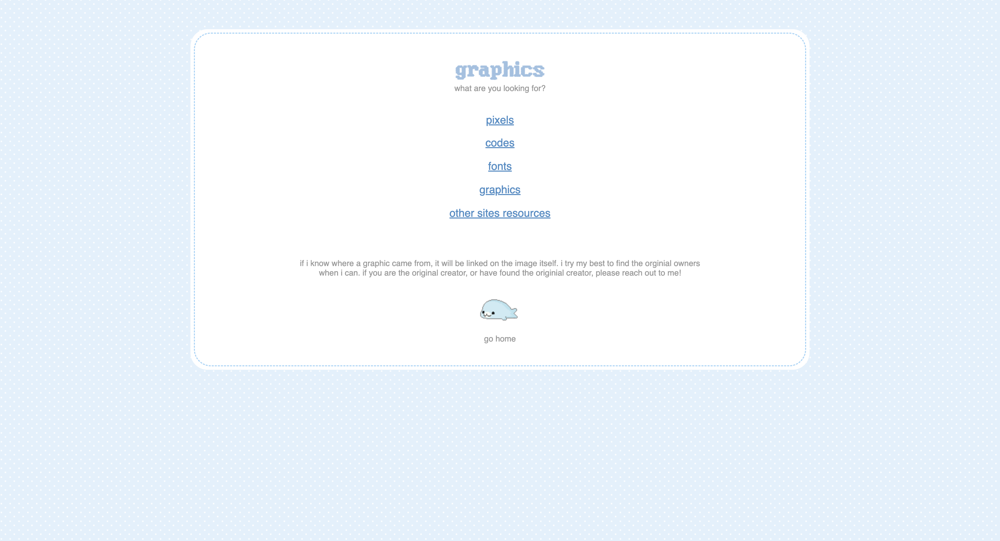
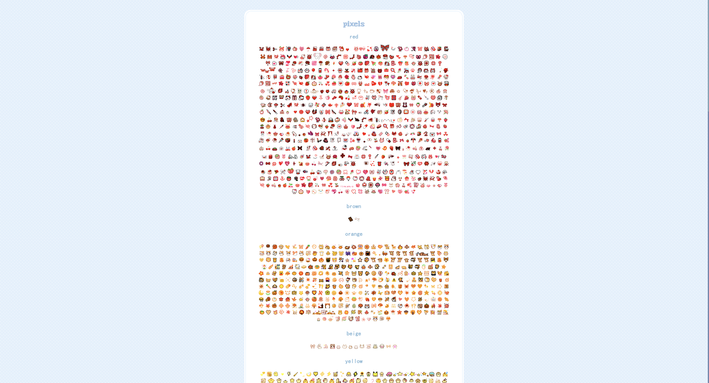

# oceanfront

contact information: oceanfrontneocities@proton.me

8/31/2026 update: hello hack club, i took your feedback for my low quality commits and for each ~hourly commit i added a basic title and pretty detailed descriptions (as descriptive as i could be, often 3 sentences). the only commits i didnt add much to would be when i deleted a file or renamed a file (just me deleting old files that often i accidentally uploaded, or renaming a file so it fit in with another page linking it) i tried my best to fix them, this was my first time using github so im sorry!

oceanfront is my personal website that i have been working on for almost two years. its a simple personal site that i use to host pixels/images on, talk about my interests, and connect with others. there is no real 'point' or 'goal' to oceanfront, its just a place for me to express myself in. besides that, i do have one goal, which is to archive as many old website's creations as i can: their pixels, images, drawings, etc.

FAQ: where can i view the site live?
A: https://oceanfront.neocities.org/

FAQ: how can i run the website on my own?
A: localhost, vercel, github itself

FAQ: how do i 'use' it?
A: it's just meant for you to browse and look around!

FAQ: not every file from your website is uploaded here. why?
A: i chose not to upload every file that's hosted on my site as some of them are a bit personal (like journal pages), but these can easily be accessed by viewing https://oceanfront.neocities.org/. i didn't upload photos that are linked to my photobook as they are HUGE and would really clog my github!

FAQ: did you use ai?
A: NO. there is NO ai on my site and there never, ever, ever will be.

tech-stack: visual studio code and neocities in-browser site editor
types of files: html (90%+), css (~5-10%), js (~1%)

# folders:

archive: 1.0 versions of certain pages, or pages i no longer 'use' or have public on my site. for example, travel.html was replaced by the new and improved travel2.html.

graphics: all the pages of different graphic pages i have (dividers, backgrounds, pixels, etc.)

photos/webfiles: webfiles is mainly images i have directly uploaded to my site files. most of the files in this folder are for the index.html.

screenshots of site:

# landing

# photobook

# games page

# graphics

# pixels (zoomed out by 50%)

